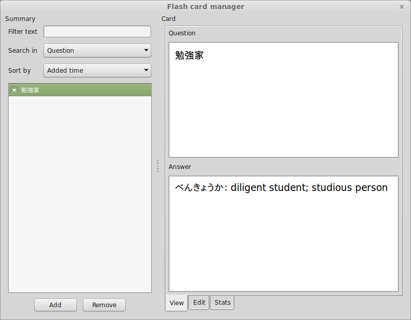
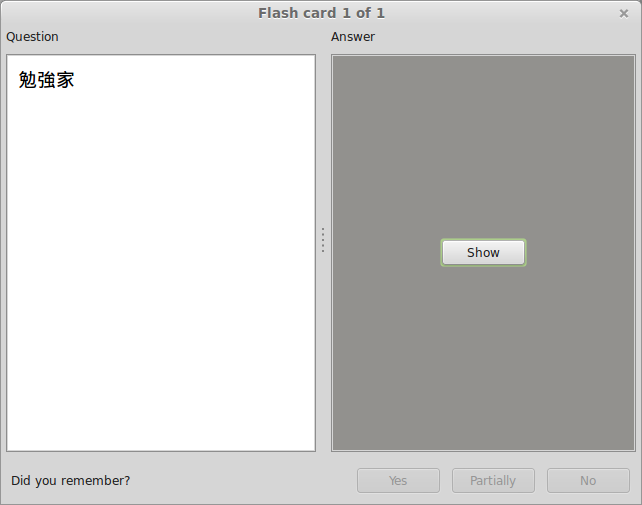

# Meganekko

Meganekko was a flash card program that I wrote to assist me with my study of the Japanese language. It was based on the
principles of the [Leitner system](http://en.wikipedia.org/wiki/Leitner_system) and took advantage of
[wxWidgets](https://www.wxwidgets.org/) to construct a cross-platform user interface. It was written in C++ in
[Code::Blocks](http://www.codeblocks.org/) IDE (project files for Visual Studio are also available). Flashcard data was
read and written to XML via the [TinyXML](http://www.grinninglizard.com/tinyxml/) library. I stopped development after I
discovered [Anki](http://ankisrs.net/), a much more mature and feature-rich application.

The full [source code](https://github.com/FooSoft/meganekko/) is available on my GitHub page. Below are some screenshots
of the application running on Linux.

## Screenshots

