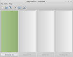
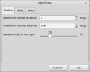
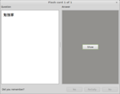
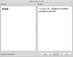

<!-- +++
Area = "projects"
GitHub = "meganekko"
Layout = "page"
Tags = ["cpp", "japanese", "meganekko", "wxwidgets", "tinyxml", "gpl license"]
Description = "Flash card program I created and used prior to switching to Anki."
Collection = "ProjectsAbandoned"
+++ -->

# Meganekko

Meganekko was a flash card program that I developed to make it easier to remember Japanese vocabulary and Kanji. It was
based on the principles of the [Leitner system](http://en.wikipedia.org/wiki/Leitner_system) and took advantage of
wxWidgets to construct a cross-platform user interface. Meganekko was written in C++ using the Code::Blocks IDE (project
files for Visual Studio are also available). Flashcard data was serialized to XML via the TinyXML library.

Although Meganekko eventually matured to a usable state, I stopped development after I discovered Anki, a more mature
and feature-rich application.

